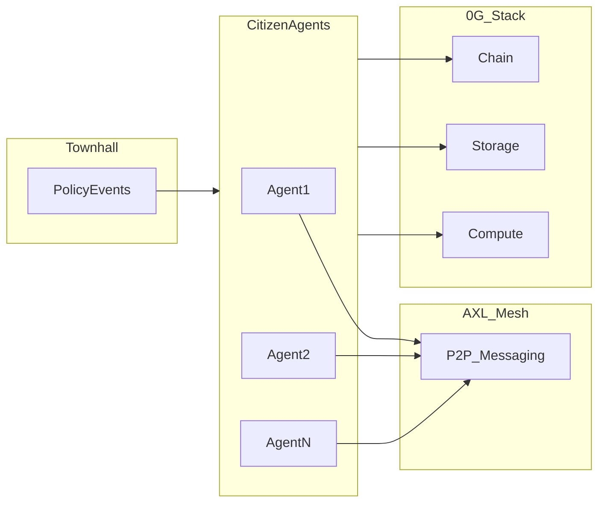

**Approved logistics:** April 27–30, 2026 · team size **1** · registration **manual** (no shared contact block required).

**Idea-only doc (no prizes):** [AI-VILLAGE-IDEA.md](./AI-VILLAGE-IDEA.md)

# 4-Day Hackathon Proposal Draft (AI Village × 0G × Gensyn)

## Context synthesis

**From [PLAN.md](../PLAN.md):** The long-term vision is an **AI village** of ~10 **citizen agents** as a policy testbed. For this **4-day** hackathon, scope **4–6 citizens** so submissions stay shippable; scale up later.

**From [PRIZES.md](../PRIZES.md):** Prize money maps to three submission lenses:

| Sponsor | Pool | What wins |
|---------|------|-----------|
| **0G** | $7,500 | **Framework / tooling / core extensions** (OpenClaw-inspired, 0G-native skills, modular brains, etc.) — ranked 1st–5th |
| **0G** | $7,500 | **Autonomous agents, swarms, iNFT** — up to **five** teams at **$1,500** each |
| **Gensyn** | $5,000 | **Best AXL use** — real utility, multi-node AXL, no centralized message bus substituting AXL — ranked 1st–3rd |

**Qualification overlap ([PRIZES.md](../PRIZES.md)):**

- **Both 0G tracks** ask for: project name/description, **contract deployment addresses**, public GitHub repo (README + setup), **demo video <3 min** + live demo, protocol/SDK explanation, team contacts. Framework track also needs **≥1 example agent** using the framework + diagram (optional but recommended). Agents/swarm track needs **swarm coordination explanation** if applicable; **iNFT** extras only if you mint.
- **Gensyn:** AXL for inter-agent/node comms **without a centralized broker replacing AXL**; **separate AXL nodes** (not in-process only); built during hackathon.

**Strategic fit:** The AI Village maps best to the **0G autonomous agents** track + **Gensyn AXL**, not necessarily the **framework** track (framework is more surface area in 4 days). Teams can still enter framework if they want.

---

## Simplest solution that still clears the bar

Use this to keep a **4-day** build feasible:

| Requirement | Minimal approach |
|-------------|------------------|
| **0G “contract deployment addresses”** | Deploy **one** tiny on-chain anchor on 0G Chain (e.g. policy/run hash registry or placeholder contract). **Economy stays in 0G Storage**; README states “contracts = anchor only.” Confirm with organizers if literal zero contracts is acceptable; if not, one contract is the cheapest compliance path. |
| **0G agents track** | **4–6 citizens** (not 10), **one** mayor/townhall policy episode (tax/gift + broadcast), **Gini before/after** from Storage snapshots. **No iNFT** unless you have spare time. |
| **“Swarm” wording** | Describe coordination as: **townhall AXL fan-out** + **bilateral trade offers/accepts over AXL** + orchestrator settlement (see mechanics). Still avoid a full planner/researcher/critic swarm unless time allows. |
| **Gensyn** | **≥2 machines/processes**, each with an AXL node; demo **recv** on citizens from mayor’s **send**; no Redis/SQS as the real bus. |
| **Framework track (avoid for minimal)** | Needs reusable toolkit + example agent + diagram—save for a team with extra capacity. |
| **Submission pack** | Start a **checklist doc on Day 1** (video script stub, SDK list, contacts) so Day 4 is polish only. |

---

## Hardened AI Village vision (product; aligns with PRIZES.md)

**Ledger (Storage-primary — team choice):** Canonical **citizen balances and world state** live in **0G Storage** (versioned rounds, serialized state, optional root/hash for integrity and replay). Use **0G** for this layer wherever possible; prefer Storage over full on-chain accounting for velocity while still demonstrating **0G Storage** in submissions. **0G Chain** is **optional and minimal**: deploy only if the story needs it (e.g. policy registry, treasury anchor, iNFT) or to satisfy “contract addresses” in [PRIZES.md](../PRIZES.md)—if none, document **N/A** with rationale and point judges to **Storage roots / deployment IDs** per 0G docs.

**Concrete Storage pattern:** Each **round** writes a snapshot (balances, role params, policy version) + append-only **event log** (tax/gift/announcement). **Inequality (confirmed):** compute and **persist `gini` (or chosen coefficient) after every round** on the **end-of-round** balance vector (after trades settle), so you have a **time series** for charts and the demo. Optional fields on the same snapshot: `gini_after_townhall` (after step 3, before trades) to separate policy vs market in one round. Optional: Merkle root / indexer reference per round for verification storytelling.

**Primary outcome:** **Reduce inequality** over the run—plot **Gini vs round**; highlight the round where a major **policy** lands and how **Pattern B** trades move the curve afterward.

**Citizens:** Each has **money**, a **job** tied to a **role** (mayor, butcher, teacher, …), and **peer-to-peer communication** with other citizens over **AXL**.

**Townhall:** Can **change monetary policy** (parameters), **gift** and **tax** (implemented as updates to Storage-backed balances). **Tax base (confirmed): wealth** — after **earn**, apply e.g. `tax = rate * balance` (floor at zero), then UBI/subsidies; no separate **flow** / income ledger required for v1. **Broadcast** to all citizens is **application-level**: townhall AXL node **fan-out** (one `/send` per known citizen public key). There is no separate AXL “multicast API”; avoid centralized brokers for the real control plane. Optionally **anchor** the official policy text or run hash on Storage for durability (AXL queues are not persistent).

**Time:** **Adaptive rounds**—cap by **max ticks** and **per-tick inference/token budget** rather than fixing tick count up front.

**Exchange (confirmed):** **Pattern B — bilateral trades** over **AXL** after **townhall** each round (**policy-first** order); **orchestrator** is the only writer to balances in **0G Storage** so money stays consistent.

**Prize hooks:** **0G** — Storage + Compute for agents and memory; **Gensyn** — multi-node AXL for townhall fan-out, **trade negotiation**, and citizen↔citizen chat; **Framework** — package Citizen / Townhall / PolicyRun / metrics as reusable primitives with one example village.

---

## How the simulation works (mechanics)

This section makes the **loop**, **money flows**, and **policy effects** explicit. “Players” here means **autonomous citizen agents** (each bound to an AXL node or process); **you** are not playing a hotseat game unless you add a UI later.

### One-sentence model

Each **round**, the world has a **single authoritative balance sheet** in **0G Storage**. A small **orchestrator** applies **earn**, then **monetary policy** (so balances reflect tax/UBI **before** trading), then lets **LLM citizens** negotiate **bilateral trades** over AXL; the orchestrator **settles** only matched trades into the next snapshot so **inequality metrics** stay reproducible.

**Round order (confirmed — policy first):** **Earn → Townhall (broadcast + apply policy) → Citizen phase (AXL chat + offers) → Settle trades → Snapshot.**

### Round loop

1. **Load snapshot** \(t\): balances, roles, current policy parameters, optional inventories if you add goods later.
2. **Automatic income (“earn”)**: each role gets **wage or revenue** by rule (e.g. teacher +80, butcher +sales, mayor +stipend)—**no LLM** required, or LLM only for optional flavor text.
3. **Townhall phase**: mayor/townhall **broadcast** policy via AXL fan-out; orchestrator applies **monetary policy** to balances (tax, UBI, subsidies—see below). Citizens **trade only after** this step, so their offers reflect **post-policy** balances.
4. **Citizen phase (LLM + AXL)**: agents **observe** the broadcast and current balances, **chat**, and run **bilateral trade** over AXL using the **fixed message schema** (see below); optional DMs for flavor.
5. **Settle trades**: orchestrator takes only **matched** OFFER+ACCEPT (same id, amounts, parties), checks **sufficient balance**, applies **one** transfer each, appends **event log**. Unmatched offers expire this round.
6. **Write snapshot** \(t+1\): balances, event log tail, round index. **Required:** compute **`gini_end`** from **final** balances this round and **store it** (and optionally append to a `gini_series` in Storage or the same snapshot doc). **Recommended for the video:** also compute **`gini_after_townhall`** right after step 3 and store on the snapshot so each round can show **policy-only** vs **policy + trades** without re-simulating.

Repeat for N rounds or stop after **one** policy episode for the minimal demo—**even a one-episode run still records Gini each round** so the series is never empty.

The **LLM** adds **dialogue and intent**; the **orchestrator** keeps **accounting honest** so the simulation doesn’t “hallucinate money.”

### How citizens exchange money

**Chosen for this project: Pattern B — bilateral trade over AXL.**

| Pattern | What happens | Pros | Cons |
|--------|----------------|------|------|
| **A — No peer trades** | Wages + townhall only; AXL for chat. | Easiest. | Not selected. |
| **B — Bilateral (selected)** | A sends B an AXL message; B **ACCEPT**s with same trade id; orchestrator **settles** cash (goods can be **cosmetic** in v1: only balances move). | Strong **Gensyn** demo; inequality can worsen or improve via deals. | Needs clear message schema + timeouts. |
| **C — Posted prices** | Fixed shop rules. | Middle ground. | Fallback if B slips schedule. |

**Minimal trade schema (v1):** Use JSON (or newline JSON) in AXL payloads, e.g. `TRADE_OFFER { id, from, to, pay_amount, note }` and `TRADE_ACCEPT { id }` / `TRADE_REJECT { id }`. **One active offer per (from,to) pair per round** to limit ambiguity. **Orchestrator** is sole authority: it never trusts free-form LLM output for amounts—only parses **structured** accept matching a known offer.

**4-day risk:** If bilateral settlement slips, **fallback** to **A** for submission (AXL chat-only) and document “trade UI cut”; keep **C** as a one-day patch (butcher posts one price in Storage).

### How monetary policy impacts them (concrete levers)

Policy is **parameters + transfers** applied in the **Townhall phase** (**after earn, before trades**—confirmed).

- **Primary tax (confirmed — wealth base):** after step 2, each citizen’s balance is `B`. Flat rate `α ∈ [0,1]`: post-tax `max(0, B − α·B)`. Optional: **brackets on `B`** for progressive wealth tax without tracking income flows.
- **Progressive / flow tax (optional stretch):** brackets on **last-round income** only if you add `last_round_earnings` / trade net to the snapshot schema.
- **Universal gift / UBI:** add fixed amount to everyone, or **larger to bottom quartile** to target inequality.
- **Role-specific subsidy:** e.g. +50 to teacher this round (industrial policy toy).
- **“Interest” or savings rule (optional):** multiply balances by a scalar (inflation/deflation toy).

**Effect on inequality:** A **flat tax + UBI** often compresses Gini if UBI is uniform; **subsidy to poor** directly targets your metric. **Reporting:** the **Gini time series** (every round) is the main artifact; call out the round index when policy parameters change and how **`gini_after_townhall`** vs **`gini_end`** diverge when trades matter.

### What gets stored where

- **0G Storage:** snapshots, event log, optional Merkle/root per round; **source of truth** for balances.
- **AXL:** **signals** (announcements, DMs, trade offers); not the ledger of record unless you duplicate (avoid inconsistency—**settle in one place**).
- **0G Compute:** **per-citizen inference** to turn observation → message + intent.
- **Minimal contract (if any):** e.g. hash of `(policy_id, round, storage_root)` for PRIZES “addresses”—not required to execute taxes on-chain for the toy economy.

### Design locked for v1

- **Tax base:** **Wealth** — tax uses **balance after earn** in the townhall step; simplest bookkeeping, no flow accumulator unless you add it later.
- **Inequality metrics:** **`gini_end` every round** (required); **`gini_after_townhall`** same round (recommended). **Round order + trades:** **policy-first**, then **Pattern B** bilateral settlement.

---

## Four-day structure (theme-first, compressed)

**Recommendation:** **Theme-first** with **mandatory end-of-day milestones** (C-style), because there is no fifth buffer day.

- **Day 1–2:** Stack + **thin vertical slice** (Storage write/read, one Compute call, **two AXL nodes**, **OFFER/ACCEPT** parsed by orchestrator mock).
- **Day 3:** Full village loop + **settled bilateral trades** + **one** policy run + **Gini recorded every round** (time series in Storage or logs).
- **Day 4:** **Submission-only:** video (<3 min), README, live demo, addresses, contacts; **no new features**.

Sponsor-pillar sequencing is optional; for **4 days**, avoid splitting “AXL day” vs “Storage day” too rigidly—run integration early.

---

## Proposal document outline (copy-ready sections)

Use this as the spine of your external or internal proposal; adjust names/dates/venue when known.

### 1. Title and thesis (2–4 sentences)

- **Working title:** e.g. *AI Village Hackathon: Simulating Policy Impact with On-Chain Agents*
- **Thesis:** A small set of autonomous citizens (e.g. **4–6** for a 4-day build), a townhall, and one concrete policy episode—implemented with **0G Compute**, **canonical economic/world state on 0G Storage**, **a minimal 0G Chain anchor if required for submissions**, and **AXL** for coordination—form a legible before/after story on inequality (or a related metric).

### 2. Goals

- **Participant:** Ship a demo that satisfies at least one prize track; document architecture; multi-node AXL where applicable; contracts deployed where relevant.
- **Organizer:** Clear judging rubric aligned with sponsor docs; mentor office hours per stack; submission checklist mirroring [PRIZES.md](../PRIZES.md).

### 3. Tracks (explicit mapping)

- **Track 0G — Framework ($7.5k ladder):** SDKs, skills, OpenClaw-style extensions, developer tooling; must include a **working example agent** using the framework.
- **Track 0G — Agents / swarms / iNFT ($7.5k, 5×$1.5k):** Village citizens, swarms, iNFT intelligence—explain coordination or iNFT proof per requirements.
- **Track Gensyn — AXL ($5k ladder):** Meaningful AXL integration, **cross-node** demos, no central broker replacing AXL; quality, docs, working examples per Gensyn criteria.

*Optional rule:* One project may be eligible for multiple tracks if it meets each track’s requirements; state whether **double-dipping** for separate sponsor pools is allowed (clarify with sponsors if unsure).

### 4. Four-day schedule (theme-first)

| Day | Focus | Suggested outcomes (exit criteria) |
|-----|--------|-----------------------------------|
| **Day 1** | Kickoff, repos, 0G + AXL env; **scope lock** (citizen count, one policy, tracks) | 0G Storage + Compute “hello”; **two AXL nodes** send/recv; README stub + submission checklist file started |
| **Day 2** | World model: Storage snapshots + event log; mayor **fan-out** skeleton; optional **minimal contract** deploy | Balances + roles in Storage; townhall can message all citizen keys; contract address in README if using anchor |
| **Day 3** | Citizen agents (4–6), one full **policy episode**, **Pattern B** trades, **`gini_end` every round** (+ optional `gini_after_townhall`) | End-to-end recording + inequality time series for demo; no new infra dependencies |
| **Day 4** | **Freeze code**; demo video (<3 min); live demo URL; final README (SDKs, setup, coordination paragraph); submit | All [PRIZES.md](../PRIZES.md) lines checked; optional judging block |

**Office hours:** Days 1–2. **Submission surgery:** first half of Day 4 only—reserve afternoon for upload and breakage.

### 5. Resources and constraints

- **Required reading:** [0G docs](https://docs.0g.ai/), [AXL docs](https://docs.gensyn.ai/tech/agent-exchange-layer), repos linked in [PRIZES.md](../PRIZES.md).
- **Project references:** [0G agent skills](https://github.com/0gfoundation/0g-agent-skills), [axl](https://github.com/gensyn-ai/axl), collaborative demo linked from PRIZES.
- **Non-goals:** Centralized broker posing as “agent mesh”; submissions that only use AXL in-process without multi-node proof (Gensyn).

### 6. Judging (high level)

- **0G framework:** Extensibility, clarity for other builders, 0G feature use, example agent quality.
- **0G agents/swarm/iNFT:** Autonomy, persistence, coordination clarity, iNFT evidence if claimed.
- **Gensyn:** Depth of AXL integration, utility, code quality, documentation, working cross-node examples.

### 7. Success metrics (for organizers)

- N submissions with valid checklist; M demos with live links; at least K multi-node AXL demos; post-event open-source footprint (stars/forks optional).

### 8. Risks and mitigations

- **Integration complexity:** Front-load Days 1–2 setup; provide starter template (e.g. from repo [.agents/skills/scaffold-project/SKILL.md](../.agents/skills/scaffold-project/SKILL.md) if this workspace becomes the canonical hackathon repo).
- **Scope creep:** Enforce “one vertical slice” by **end of Day 3**; Day 4 is polish only.
- **AXL networking:** Pair teams for cross-node tests early.

---

## Mermaid: high-level architecture story (for proposal diagrams)

---

## Next steps

1. **Logistics:** done (Apr 27–30, solo, manual registration).
2. **Sponsors / eligibility:** confirm as needed (see todos above).
3. **Participant pack:** optional handbook from Day 1–4 table + checklist.
